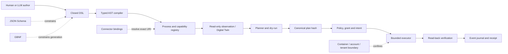

# POA v1 architecture standard

- Status: draft implementation standard
- Version: 1
Meaning of POA: **Process-Oriented Architecture**

The key unit in POA is not a service endpoint or an LLM tool call. It is a
controlled process whose requested intent, selected capabilities, concrete
runtime route, authority, effects and verification evidence can be inspected
independently.

The words **MUST**, **MUST NOT**, **SHOULD** and **MAY** are normative.

## 1. Scope

POA standardizes how a system turns an authored request into a verified effect:

1. validate authored data as a closed DSL;
2. compile it into a typed AST;
3. select a declared process and capabilities;
4. resolve capabilities to concrete URI Processes from a registry;
5. observe the current target without mutating it;
6. create a secret-free, expiring plan and hash it;
7. obtain separate authority bound to the exact plan;
8. execute only through allowlisted adapters and boundaries;
9. read the effect back and write an immutable receipt.

POA complements SOA. SOA owns stable service capabilities and deployments;
POA composes those capabilities into a process with dependencies and an
observable business outcome.

POA v1 does not standardize a broker, programming language, database, LLM,
container product or cloud provider. It does not make natural-language prompts
safe by declaration and does not create execution authority.

## 2. Reference architecture

No arrow in this diagram implicitly grants authority. In particular, a valid
DSL document, a matching GBNF string, an available binding, an observed Twin
state or a successful dry-run is evidence—not permission to apply.

## 3. Normative components

### 3.1 Authoring boundary

`POA-AUTHOR-001` — Untrusted human, LLM, MCP and HTTP input MUST be accepted
only through a versioned, closed JSON Schema. Object variants MUST use
`additionalProperties: false`, bounded lengths and explicit enumerations.

`POA-AUTHOR-002` — When an LLM generates the request, generation MUST also be
constrained by a versioned grammar. Runtime validation MUST apply both JSON
Schema and the canonical GBNF language; either failure is terminal.

`POA-AUTHOR-003` — The authoring language MUST NOT contain raw shell commands,
arbitrary executable paths, transport configuration, credential values,
credential locators, grants or concrete connector URIs.

`POA-AUTHOR-004` — Inputs specific to a business process MUST be stored as a
separately validated immutable artifact. The request carries only
`input_ref` and `input_sha256`; a generic free-form payload is not part of the
POA control contract.

The v1 authoring request has only two operations:

- `inspect`: read process metadata and readiness;
- `plan`: create a dry, secret-free exact plan.

There is intentionally no LLM-generated `apply` operation.

### 3.2 Typed compiler

`POA-COMPILER-001` — Validation MUST produce a typed AST, not pass the original
dictionary or JSON object directly to an adapter.

`POA-COMPILER-002` — The compiler MUST serialize the AST with RFC 8785 and
record SHA-256 digests of the AST, schema and grammar. The hash profile is
`RFC8785+SHA-256`; implementations MUST NOT substitute a runtime-specific
`sort_keys` format without proving byte equivalence for the accepted numeric
and Unicode domain. Validation errors MUST name the failed rule or path without
reflecting the rejected value.

`POA-COMPILER-003` — Defaults MUST NOT hide missing authority, target,
management plane, effect class or verification. Ambiguous highest-priority
bindings MUST fail closed.

### 3.3 Process registry

A `poa.process/v1` definition is authored with abstract `capability_ref`
values. This keeps long-lived intent independent from transports and deployment
details. A compiled `poa.plan/v1` contains concrete `process_uri` values for
every DAG node.

`POA-REGISTRY-001` — The LLM MAY select only a declared `process_ref` or
capability. It MUST NOT invent a URI, scheme, target, connector or transport.

`POA-REGISTRY-002` — A trusted registry MUST resolve exactly one compatible
binding for each capability using observed target facts. Zero or multiple
equally valid bindings MUST stop planning.

`POA-REGISTRY-003` — A URI identifies a logical process; it does not prescribe
transport and does not grant authority. The binding owns the adapter and target.

`POA-REGISTRY-004` — Wildcards MAY appear in policy scopes. Every compiled DAG
node MUST use an exact URI and exact target reference.

`POA-REGISTRY-005` — A selected binding MUST be emitted as a closed
`poa.binding/v1` document. It binds capability, exact URI, target and adapter to
the immutable observation used during selection. A mutable registry row or an
untyped lookup result is not sufficient planning evidence.

### 3.4 Observation and Digital Twin

`POA-OBSERVE-001` — Observation MUST be read-only and freshness-bounded. A
Digital Twin provides facts for planning and verification; it MUST NOT act as
mutation authority.

`POA-OBSERVE-002` — Facts that affect target or management-plane selection MUST
be explicit. Unknown facts MUST remain unknown rather than falling back to a
convenient connector.

`POA-OBSERVE-003` — Each planning observation MUST be represented by a closed
`poa.observation/v1` document with observation time, validity deadline, target,
fact schema, immutable fact artifact and digest. `valid_until` MUST be later
than `observed_at`; expired facts cannot authorize a new plan.

### 3.5 Plan and authority

`POA-PLAN-001` — Planning MUST not execute a mutating adapter. A plan contains
exact URIs, target references, input hashes, effect sets, dependency order,
timeouts, retry budgets, idempotency keys, verification and execution boundary.
Effects are multi-dimensional: a model query can simultaneously declare
`read_data`, `credential_use`, `quota_consumption` and `remote_session`, while a
project-aware tool may additionally declare `local_write`.

`POA-PLAN-002` — Plans MUST be canonically hashed, short-lived and free of raw
prompts, credentials and full tool output. A later executor MUST recompute and
compare the exact plan hash before dispatch.

`POA-AUTH-001` — Authority is a separate policy result and SHOULD be represented
by a short-lived grant plus a runnable intent. Both MUST bind subject, resource,
scope and the exact `plan_ref`.

`POA-AUTH-002` — Steps with `external_write`, `credential_use`,
`quota_consumption`, `remote_session` or `destructive` effects MUST declare
approval. Approval metadata in the process is a requirement, not proof that
approval was supplied. A standing policy may satisfy routine provider access,
but the exact grant still binds the plan.

`POA-AUTH-003` — Grants MUST expire and SHOULD be single-use. Completion SHOULD
complete the intent and revoke or consume the grant even when cleanup reports a
separate error.

### 3.6 Executor

`POA-EXEC-001` — Execution MUST use an allowlisted adapter selected by the
registry. The executor MUST NOT expose a generic shell or arbitrary executable.

`POA-EXEC-002` — User text is data. If a tool accepts a task, it SHOULD receive
it through a data channel such as stdin or a validated artifact, never by
concatenation into argv, a shell string, URI or environment variable.

`POA-EXEC-003` — Credentials MUST be resolved inside the execution boundary by
the provider/runtime configuration. Credential values and local file/Vault
locators MUST NOT cross the authoring or MCP boundary.

`POA-EXEC-004` — The boundary MUST be explicit, for example tenant, account,
container, project mount and provider profile. Host shell access and arbitrary
executables default to false.

`POA-EXEC-005` — Every command MUST define idempotency behavior. Compensation
MUST be a separately declared capability/URI Process; it is never inferred from
a step name.

`POA-EXEC-006` — Dispatch MUST accept only a closed
`poa.execution-envelope/v1` created by the trusted authority boundary. It binds
the immutable request and plan, grant, intent, subject, idempotency key and a
monotonic lease revision. Lease renewal creates a new event; it does not mutate
or extend the original plan or grant beyond their validity.

### 3.7 Verification and receipt

`POA-VERIFY-001` — Dispatch success is not effect success. Every step MUST
declare at least one read-back verification capability and expectation schema.

`POA-VERIFY-002` — The event journal MUST emit closed `poa.event/v1` records and
distinguish requested, planned, authorized, started, lease-renewed, completed,
verified, failed, compensated, cancelled, timed-out, denied and expired facts.
Sequence numbers and optimistic concurrency or equivalent single-consumption
control are required.

`POA-RECEIPT-001` — A terminal receipt MUST bind the process, plan, grant,
intent, exact step URIs and verification artifacts. It MUST record bounded
state, output hashes and sizes instead of raw output or secret material.

`POA-RECEIPT-002` — Large or sensitive evidence belongs in a separately
authorized artifact store. A receipt is an index and integrity proof, not an
unbounded debug dump.

## 4. Document model

The machine contract is `standard/poa-process.schema.v1.json`.

| Document | Producer | Purpose | Authority |
|---|---|---|---|
| `poa.process/v1` | process owner | capabilities, DAG, effects, verification | none |
| `poa.request/v1` | human/LLM/MCP | inspect or request a plan by immutable refs | none |
| `poa.observation/v1` | observer/Digital Twin | fresh, immutable target facts | evidence only |
| `poa.binding/v1` | trusted registry | exact capability/URI/target/adapter selection | none |
| `poa.plan/v1` | trusted planner | exact URI/target plan and required authority | none |
| `poa.execution-envelope/v1` | authority boundary | exact dispatch binding and lease | bounded dispatch input |
| `poa.event/v1` | executor/control | ordered lifecycle and lease facts | historical evidence only |
| `poa.receipt/v1` | trusted executor/verifier | immutable execution and effect evidence | historical evidence only |

The process definition deliberately has no concrete connector URI. The plan
deliberately has no credential and no generic payload. The receipt deliberately
has no raw output.

## 5. MCP profile

An MCP façade conforming to POA SHOULD expose a narrow surface:

- `process.inspect` — requires an `inspect` DSL object;
- `process.plan` — requires a `plan` DSL object;
- `process.execute` — accepts only a trusted execution envelope containing the
  original request, execution id, plan hash, grant ref and intent ref.

The execute envelope is not generated by the POA GBNF. A control plane builds
and validates `poa.execution-envelope/v1` after authority reconciliation.

The MCP server MUST:

1. execute every advertised `inputSchema`, rather than treating it as UI-only
   metadata;
2. expose the versioned JSON Schema and GBNF as readable resources;
3. bind each endpoint to an exact account/tenant/provider/tool or process
   resource when those dimensions exist;
4. authenticate Streamable HTTP, validate Host and Origin, and resist DNS
   rebinding;
5. return safe errors that do not echo rejected values;
6. route plan and execute through the same domain/CQRS path as CLI and REST.

## 6. Injection model

POA uses several independent controls because “injection” is not one problem.

| Threat | Required control |
|---|---|
| undeclared fields or type confusion | closed JSON Schema |
| unconstrained model serialization | canonical GBNF plus runtime schema validation |
| raw shell/argv injection | no shell field; allowlisted adapter and generated argv |
| path/URI traversal | typed references, exact registry bindings, boundary checks |
| credential exfiltration | no credential channel; runtime-local secret resolution |
| replay or request substitution | canonical request/plan hash, expiry, single consumption |
| confused deputy | exact subject/resource/scope grant plus intent |
| false success | independent read-back and receipt |
| semantic prompt injection | instruction/data separation, policy and isolated effects |

JSON Schema and GBNF give strong structural guarantees. They do not prove that
all natural-language content is semantically harmless. Keyword filters and
secret-pattern rejection are useful defense in depth, but authority, adapter
allowlists, isolation and effect verification remain mandatory.

## 7. Failure semantics

A conforming implementation fails closed when:

- the schema or grammar is missing, changed without a version or fails its
  integrity check;
- an input contains an additional property;
- schema and GBNF disagree;
- process or capability references are absent;
- a DAG has a missing dependency or cycle;
- binding resolution is missing or ambiguous;
- observed target facts are stale or unknown for a safety decision;
- dry-run, plan hash, grant, intent, target or subject does not match;
- a plan expired or was already consumed;
- output verification fails.

Cancellation, timeout, denial and expiry are terminal outcomes, not generic
failures. Each MUST produce an event and a terminal receipt. A client disconnect
does not by itself cancel a run; cancellation is an authorized, idempotent
control operation bound to the execution id.

Failure events and receipts SHOULD use stable error codes and MUST avoid copying
rejected values, prompts, secrets or unbounded stdout/stderr.

## 8. Conformance levels

| Level | Required capabilities |
|---|---|
| POA-A — Authoring | closed process/request schema, GBNF for LLM generation, typed AST, DAG validation |
| POA-P — Planning | POA-A plus registry bindings, observation, exact URI plan, dry-run, canonical hashes |
| POA-X — Execution | POA-P plus plan-bound authority, isolated adapter, idempotency, read-back and immutable receipts |

A project MUST name the level it implements. Publishing a schema alone is not
enough to claim POA-X.

## 9. Versioning

- Schema identifiers and document `schema` values are immutable within a major
  version.
- Removing a field, tightening accepted existing values or changing canonical
  key order requires a new contract version.
- New object fields cannot be silently added because objects are closed.
- GBNF and JSON Schema are released as one compatibility unit and MUST have
  recorded SHA-256 digests plus the `RFC8785+SHA-256` hash profile.
- Old receipts remain readable and auditable after a new process version.

## 10. Evidence basis

The standard generalizes verified internal patterns rather than treating a
single implementation as universal:

- `knowledge://subactor/architecture.strategy-dsl/v1` — capability authoring
  is separate from URI binding and DSL is not authority;
- `knowledge://subactor/architecture.autonomy-execution-pipeline/v2` —
  observation, dry-run, plan hash, grant, apply and EQL/read-back form one path;
- `knowledge://subactor/architecture.openwebui-mcp-control-boundary/v2` — MCP
  is a typed façade over Control, not a side door;
- `repo://wellmanifest/wellm/docs/SOA_POA_CQRS_ES.md` — POA composes concrete
  URI Processes, DAGs, idempotency and terminal receipts;
- the account-scoped CLI implementation demonstrated closed Schema+GBNF input,
  generated argv, stdin-only task data, plan/intent/grant binding, container
  confinement, safe receipts and adversarial E2E checks.
