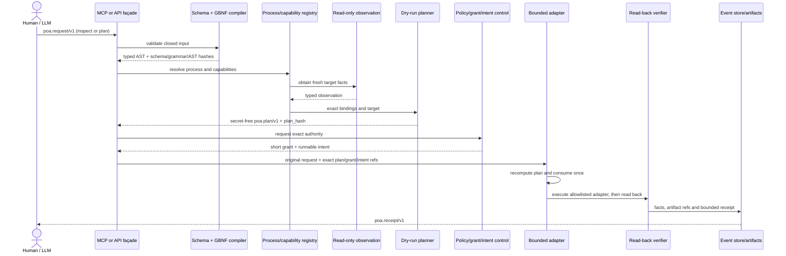

# POA v1 logic flow and implementation guide

This guide shows how to implement the normative architecture in
`ARCHITECTURE.md`. Examples use an account-scoped LLM project review because it
exercises identity, provider, CLI, project, MCP and artifact boundaries, but the
same flow applies to infrastructure, publishing and operational remediation.

## 1. End-to-end sequence



## 2. Start with a process definition

The authored definition names capabilities, not transports:

```json
{
  "schema": "poa.process/v1",
  "process_ref": "poa://example.test/process/release-review/v1",
  "title": "Review a project through an account-scoped LLM CLI",
  "owner": "service:control",
  "input_schema_ref": "schema://example.test/release/request/v1",
  "output_schema_ref": "schema://example.test/release/result/v1",
  "policy_refs": ["policy://example.test/automation/bounded/v1"],
  "steps": [
    {
      "id": "inventory",
      "capability_ref": "capability://example.test/repository/inventory/v1",
      "kind": "query",
      "effect_class": "read_only",
      "depends_on": [],
      "requires_approval": false,
      "timeout_seconds": 30,
      "max_attempts": 1,
      "idempotency": "read_only",
      "verification": [{
        "capability_ref": "capability://example.test/repository/fingerprint/v1",
        "expectation_schema_ref": "schema://example.test/release/fingerprint/v1"
      }]
    },
    {
      "id": "review",
      "capability_ref": "capability://example.test/llm/project-review/v1",
      "kind": "command",
      "effect_class": "local_write",
      "depends_on": ["inventory"],
      "requires_approval": true,
      "timeout_seconds": 300,
      "max_attempts": 1,
      "idempotency": "required",
      "verification": [{
        "capability_ref": "capability://example.test/repository/fingerprint/v1",
        "expectation_schema_ref": "schema://example.test/release/fingerprint/v1"
      }]
    }
  ]
}
```

The compiler rejects duplicate ids, missing dependencies, cycles, mutating
`query` steps and high-impact steps without declared approval.

## 3. Accept only a constrained request

Canonical plan request:

```json
{"schema":"poa.request/v1","operation":"plan","process_ref":"poa://example.test/process/release-review/v1","input_ref":"artifact://example.test/inputs/release/r1","input_sha256":"1111111111111111111111111111111111111111111111111111111111111111"}
```

The referenced input artifact is validated against the process-specific
`input_schema_ref` before planning. The generic POA request never accepts raw
credentials, local files, argv or connector configuration.

The matching GBNF contains only `inspect` and `plan`. A grammar-constrained LLM
cannot generate `apply`; runtime JSON Schema validation is still mandatory.

## 4. Resolve capability to exact URI

The registry owns target-specific bindings:

```json
{
  "capability_ref": "capability://example.test/llm/project-review/v1",
  "process_uri": "llmcli://account/project/command/review",
  "target_ref": "target://example.test/workspace/release",
  "adapter": "account-container-cli",
  "facts_required": ["account", "provider", "tool", "project"]
}
```

The adapter field belongs to the trusted registry and is not copied from the
author request. Resolution fails when required facts are unknown or when two
bindings have the same winning priority.

## 5. Build a secret-free plan

A compiled step contains exact execution identity but not executable strings:

```json
{
  "id": "review",
  "capability_ref": "capability://example.test/llm/project-review/v1",
  "process_uri": "llmcli://account/project/command/review",
  "target_ref": "target://example.test/workspace/release",
  "kind": "command",
  "effect_class": "local_write",
  "depends_on": ["inventory"],
  "input_ref": "artifact://example.test/inputs/release/r1",
  "input_sha256": "1111111111111111111111111111111111111111111111111111111111111111",
  "timeout_seconds": 300,
  "max_attempts": 1,
  "idempotency_key": "run:example:review:1",
  "verification": [{
    "capability_ref": "capability://example.test/repository/fingerprint/v1",
    "expectation_schema_ref": "schema://example.test/release/fingerprint/v1"
  }]
}
```

The full plan also contains:

- request, schema, grammar and canonical AST hashes;
- `valid_until`;
- required subject/scopes and grant TTL;
- `intent_required: true` and `plan_hash_binding: true`;
- `host_shell: false`, `arbitrary_executable: false` and
  `transport_from_registry: true`.

`plan_hash` is SHA-256 over canonical plan content before the `plan_hash` field
is added.

## 6. Authorize outside the DSL

The control plane—not the author—creates an execution envelope:

```json
{
  "execution_id": "run:example:001",
  "request_ref": "sha256:<canonical-request-hash>",
  "plan_ref": "sha256:<exact-plan-hash>",
  "grant_ref": "grant:example:001",
  "intent_ref": "intent:example:001"
}
```

Before any side effect, the executor reloads the original immutable request,
rebuilds the plan from the current versioned contracts, compares the exact
hash, checks expiry, subject/resource/scope, verifies that the intent is
runnable and atomically marks the execution id as consumed.

## 7. Execute through a typed adapter

For an account-scoped CLI adapter:

```text
process URI -> registry binding -> account/container/tool allowlist
input artifact -> tool-specific input schema -> stdin/data file
provider credentials -> runtime-local provider profile
project -> verified mount below the allowed workspace root
```

The adapter creates argv from its own allowlist. It does not append author text
to argv and does not invoke a shell. A provider credential is resolved inside
the account boundary and never appears in the request, plan, URI, event or
receipt.

## 8. Verify effects, then issue a receipt

```json
{
  "schema": "poa.receipt/v1",
  "run_id": "run:example:001",
  "process_ref": "poa://example.test/process/release-review/v1",
  "plan_ref": "sha256:<exact-plan-hash>",
  "grant_ref": "grant:example:001",
  "intent_ref": "intent:example:001",
  "state": "succeeded",
  "started_at": "2030-01-01T00:00:00Z",
  "completed_at": "2030-01-01T00:01:00Z",
  "steps": [{
    "step_id": "review",
    "process_uri": "llmcli://account/project/command/review",
    "state": "succeeded",
    "attempts": 1,
    "output_sha256": "2222222222222222222222222222222222222222222222222222222222222222",
    "output_bytes": 128,
    "effect_verified": true,
    "verification_refs": ["artifact://example.test/evidence/review/r1"]
  }],
  "raw_output_included": false,
  "secret_material_included": false,
  "receipt_hash": "<canonical-receipt-hash>"
}
```

The example illustrates shape; the conformance runner produces real hashes.
An `ok` response from a connector is not enough. `effect_verified` becomes true
only after the declared read-back matches its expectation schema.

## 9. MCP mapping

Recommended surface:

| MCP tool | Input | Result | Side effect |
|---|---|---|---|
| `process.inspect` | `poa.request/v1` inspect branch | process/binding readiness | none |
| `process.plan` | `poa.request/v1` plan branch | `poa.plan/v1` | none |
| `process.execute` | trusted execution envelope | `poa.receipt/v1` | bounded by grant/intent |

Every MCP tool must execute its advertised outer `inputSchema`. The request DSL
schema is nested within that closed envelope. The server should publish:

```text
poa://contracts/process/v1/schema
poa://contracts/process/v1/grammar
```

The façade and CLI shell route to the same compiler, planner, authority check,
executor and event store. A separate “convenient” MCP handler is a bypass.

## 10. Rejection examples

All of these fail before target resolution:

```json
{"schema":"poa.request/v1","operation":"apply","process_ref":"poa://example.test/process/release-review/v1"}
```

Reason: `apply` is absent from the authoring language.

```json
{"schema":"poa.request/v1","operation":"plan","process_ref":"poa://example.test/process/release-review/v1","input_ref":"file:///etc/passwd","input_sha256":"1111111111111111111111111111111111111111111111111111111111111111"}
```

Reason: only immutable `artifact://` references are accepted.

```json
{"schema":"poa.request/v1","operation":"plan","process_ref":"poa://example.test/process/release-review/v1","input_ref":"artifact://example.test/inputs/release/r1","input_sha256":"1111111111111111111111111111111111111111111111111111111111111111","arguments":["--unsafe"]}
```

Reason: undeclared field; the adapter owns argv.

A process definition containing `process_uri` in an authored step also fails.
Only the planner may materialize URI bindings.

## 11. Compiler outline

```text
validate_outer_tool_schema(request)
ast = validate_json_schema(request.dsl)
canonical = validate_gbnf_and_canonicalize(ast)
process = registry.load_exact(ast.process_ref)
input = artifacts.load_exact(ast.input_ref, ast.input_sha256)
validate(input, process.input_schema_ref)
assert_dag(process.steps)
facts = observe_required_targets()
bindings = resolve_each_capability_exactly_once(process, facts)
plan = dry_run(process, input.hash, bindings)
plan.hash = sha256(canonical_json(plan_without_hash))
return plan

# A separate trusted path:
assert_grant_and_intent(plan.hash, subject, resource, scope)
assert_not_expired_or_consumed(plan)
result = execute_allowlisted_adapters(plan)
evidence = read_back_declared_effects(plan)
return append_only_receipt(plan, result.hashes, evidence.refs)
```

## 12. Test matrix

At minimum, each POA implementation tests:

| Area | Positive test | Negative/adversarial test |
|---|---|---|
| schema | canonical inspect/plan | extra field, wrong type, oversized value |
| GBNF | canonical round-trip | key order/language mismatch |
| process DAG | ordered acyclic graph | unknown dependency, self-edge, cycle |
| bindings | one exact compatible route | no route, ambiguous route, stale fact |
| boundary | allowlisted adapter and target | raw argv, shell, traversal, foreign target |
| authority | exact live grant and intent | expired, wrong subject/scope/hash, replay |
| receipts | hashes, sizes, evidence refs | raw output or secret material included |
| MCP HTTP | authenticated valid Origin | foreign Origin/Host and undeclared tool field |
| end-to-end | plan leaves projections unchanged | read-only mode denies authorize/apply |

Run this repository's reference checks with:

```bash
docker compose run --rm conformance
```

## 13. Adoption checklist

Before calling a solution POA-X conformant, verify:

- [ ] every authored object is closed and versioned;
- [ ] GBNF and JSON Schema are released and hashed together;
- [ ] business input is separately schema-validated by immutable reference;
- [ ] the LLM cannot generate apply, URI, transport, shell or credential data;
- [ ] process definitions contain capabilities and plans contain exact URIs;
- [ ] observations are fresh and read-only;
- [ ] plan is dry, expiring, canonical and secret-free;
- [ ] grant and intent bind the exact plan/subject/resource/scope;
- [ ] execution is isolated and single-consumption;
- [ ] every effect has read-back verification;
- [ ] events and receipts omit raw prompts, secrets and unbounded output;
- [ ] adversarial and live read-only E2E tests exist.
